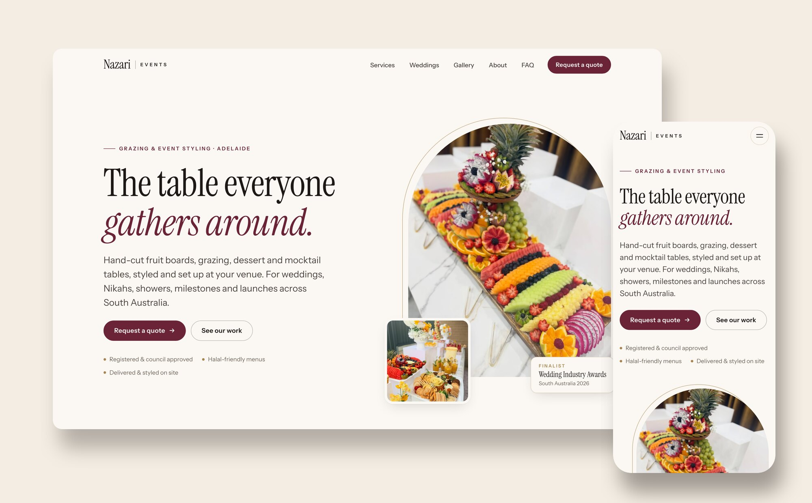
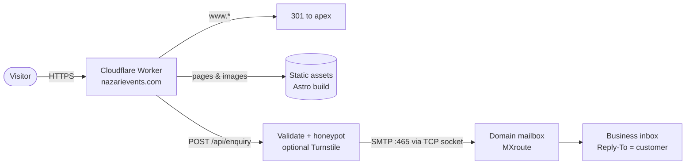
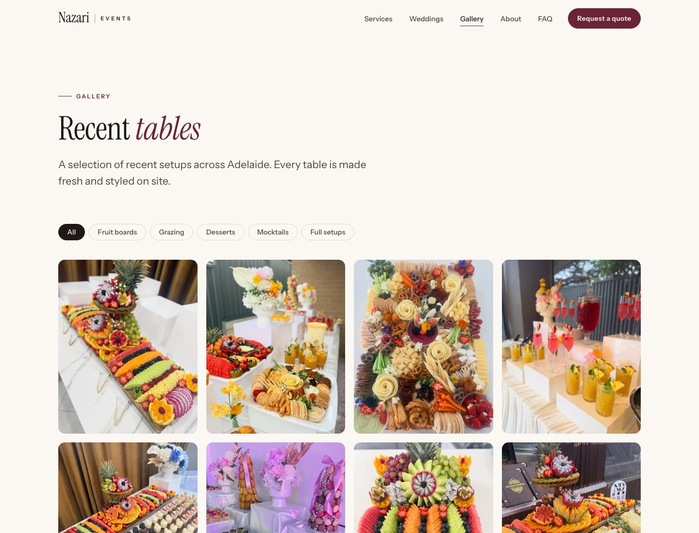
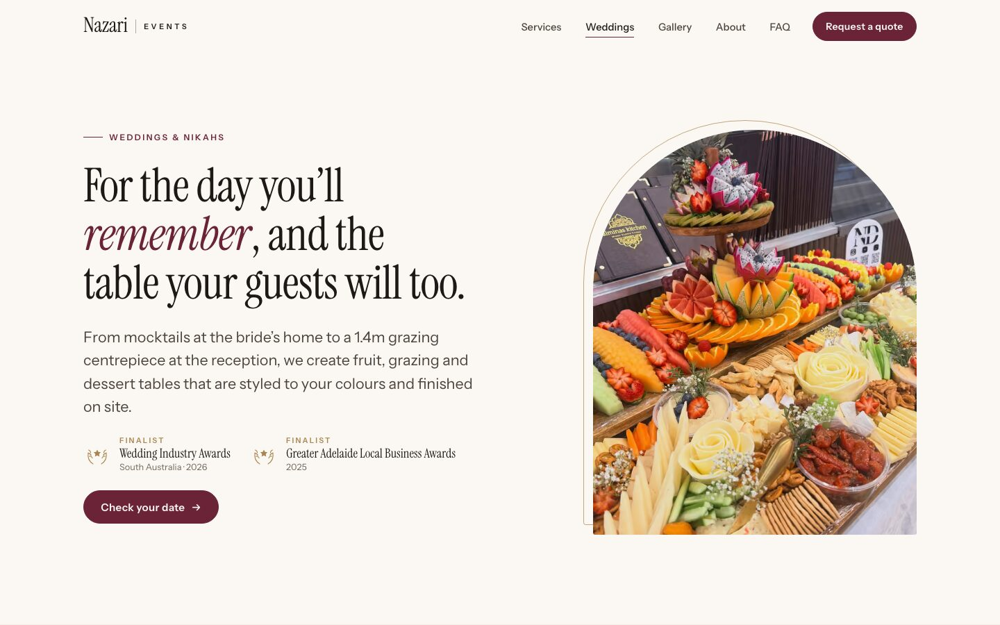
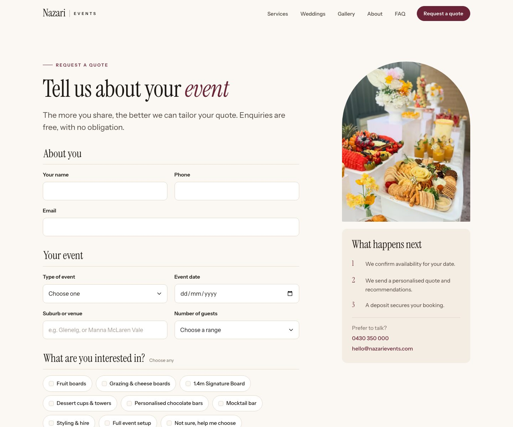
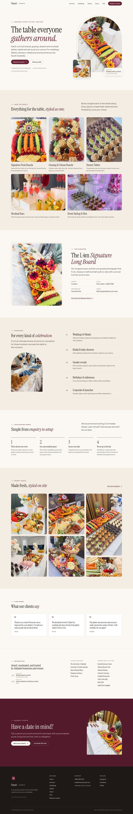
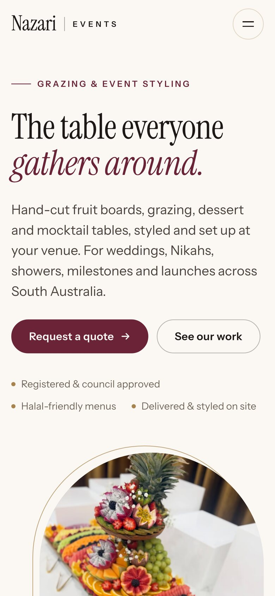

# Nazari Events

**A rebrand and website for an award-finalist grazing and event styling business in Adelaide.**

[**nazarievents.com**](https://nazarievents.com) · Astro · Cloudflare Workers · TypeScript



## The brief

My sister runs a grazing and event styling business in Adelaide: hand-cut fruit boards, grazing tables, dessert tables and mocktail bars, styled and set up at weddings, Nikahs, showers and corporate events. It started as a side business called *Nazari Desserts* and grew into a finalist in the **Wedding Industry Awards 2026 (SA)** and the **Greater Adelaide Local Business Awards 2025**.

Her online presence hadn't kept up. She had a strong Instagram, a free Wix site with a "built on Wix" banner, no website link in her bio, and nothing that showed up when you searched her name. Customers ordered by DM. She wanted to be taken seriously, with a brand that matched the quality of her work and a website that turns Instagram attention into real quote requests.

## What I did

| | |
|---|---|
| **Research** | Audited her Instagram, Facebook, TikTok and the old site, reviewing about 85 recent posts in detail. I catalogued what she actually sells, at what sizes, for which occasions, and which proof points she had but wasn't using (awards, council registration, corporate clients, venues). |
| **Positioning** | Repositioned the business from "desserts" to **luxury grazing and event styling**. Fruit boards are the hero product, and she styles the whole table, not just the food. Renamed it **Nazari Events** to match the domain. |
| **Brand identity** | Built a new palette, type pairing, logo, monogram, favicon and social share card. The arch motif echoes the event arches she styles. |
| **UX and content** | Planned the information architecture, wrote all the copy (Australian English), and designed a quote-based enquiry flow. She prices every event individually, so the site sells the experience and captures the details she needs to quote. |
| **Build and launch** | Built a static Astro site served by a Cloudflare Worker that also handles the enquiry form and emails each request to her inbox. Deployed on her own domain. |

## Results

| | Before | After |
|---|---|---|
| Website | Free `*.wixsite.com` address with a Wix banner | Custom site on `nazarievents.com` |
| How customers order | "Send us a DM" | Structured quote form, delivered to her inbox with Reply-To set to the customer |
| Credibility signals | Mostly buried | Awards, clients and venues on the home page and a dedicated Weddings page |
| Search | Not findable by name | Sitemap, canonical URLs, `LocalBusiness` and `FAQPage` structured data, share image |

**Lighthouse (mobile, live site):**

| Page | Performance | Accessibility | Best practices | SEO |
|---|:-:|:-:|:-:|:-:|
| Home | 100 | 100 | 100 | 100 |
| Services | 99 | 100 | 100 | 100 |
| Gallery | 98 | 100 | 100 | 100 |
| Quote request | 100 | 100 | 100 | 100 |

Largest Contentful Paint is 1.3 to 2.3 s on Lighthouse's throttled mobile profile, and there's no layout shift. Measured 7 October 2026.

## Features

- **Eight pages:** Home, Services (with board sizes and packages), Weddings & Nikahs, Gallery, About, FAQ, Quote request, plus a custom 404.
- **Quote request form** with pre-fill from deep links (e.g. *Ask about the Signature Board* ticks that option), inline validation and a success state. It also works with JavaScript off: the form posts directly and the Worker redirects to `/thanks`.
- **Enquiry emails** are formatted in HTML with a plain-text fallback, sent with Reply-To set to the customer so she can just hit reply.
- **Spam protection:** a honeypot field, plus optional Cloudflare Turnstile via one environment variable.
- **Gallery** with category filters and a keyboard-accessible full-screen viewer built on the native `<dialog>` element.
- **Responsive images:** 35 photos curated from her Instagram, served as AVIF/WebP in several sizes with metadata stripped.
- **Edge routing:** `www` redirects to the main domain, missing pages get the custom 404, and `/api/*` is handled by the Worker.
- **Accessibility:** semantic landmarks, a skip link, visible focus states, `prefers-reduced-motion` support, and colour tokens checked for contrast.

## Tech stack

| Layer | Choice | Why |
|---|---|---|
| Site | [Astro 7](https://astro.build), static output | Content site with no app state. Ships HTML and CSS, with the few small scripts inlined. No front-end framework or JS bundle. |
| Styling | Hand-written CSS with design tokens | Small, consistent, and easy to theme. Component styles are scoped by Astro. |
| Images | `astro:assets` + sharp | Builds AVIF/WebP `srcset`s at build time. |
| Hosting | Cloudflare Workers with static assets | Global edge, free tier, and the same deploy also runs the API. |
| Email | SMTP over Workers TCP sockets ([`worker-mailer`](https://github.com/zou-yu/worker-mailer)) | Sends through the domain's existing mailbox at no extra cost (see below). |
| Fonts | Instrument Serif + Instrument Sans, self-hosted via Fontsource | Elegant display serif with a matching sans, no third-party font requests. |
| Language | TypeScript (strict) | Type-checked across Astro components and the Worker. |

## Architecture



### Decisions worth calling out

- **Email without a paid plan or breaking existing mail.** Cloudflare Email Sending needs the Workers Paid plan. Cloudflare Email Routing would have replaced the domain's existing MXroute MX records and broken its mailboxes. Instead, the Worker opens a TLS socket to the existing mail server and authenticates as the domain mailbox, so it costs nothing extra and the existing email setup is untouched. The mailbox password is a Worker secret.
- **Quote-based, on purpose.** Board size, guest count, travel and styling all change the price, so the site gives starting points (packages, sizes, "ideal for" guidance) and asks for exactly the details she needs to quote.
- **Static-first.** Every page is pre-rendered. The Worker only runs logic for the redirect and the form, so pages are served straight from Cloudflare's edge.
- **Progressive enhancement.** Every interactive feature (menu, filters, viewer, form) works as plain HTML first, and JavaScript adds polish.
- **Content in one place.** Services, packages, FAQs, testimonials, venues and photos live in typed data files (`src/data/`), so updating the site means editing data, not markup.

## Design system

| Token | Hex | Use |
|---|---|---|
| Paper | `#fbf8f3` | Page background |
| Linen | `#f4ede3` | Alternating sections |
| Ink | `#1e1916` | Text, footer |
| Fig | `#6b2437` | Accent, buttons, emphasis |
| Blush | `#f3dfd8` | Highlights on dark backgrounds |
| Gold | `#a8844f` / `#85663a` | Decorative lines / gold text (contrast-safe) |

**Type:** Instrument Serif for headings, with italic fig-coloured emphasis, and Instrument Sans for body text and UI. **Motif:** arch-topped photo frames with a thin offset gold outline, a nod to the arches at her events.

## Screenshots

| Gallery | Weddings | Quote request |
|---|---|---|
|  |  |  |

<details>
<summary>Full home page (desktop) and mobile</summary>

 

</details>

## Running it locally

```bash
npm install
npm run dev        # Astro dev server
npm run preview    # production build served by the real Worker at http://127.0.0.1:8787
npm run check      # type-check the site and the Worker
```

Without mail credentials, `npm run preview` does a dry run of the enquiry form: the email is logged to the console instead of sent.

## Project structure

```
src/
  data/          site content: services, packages, FAQs, testimonials, photos
  pages/         one file per route
  components/    header, footer, photo frame, logo, awards, CTA…
  layouts/       base HTML, SEO and structured data
  styles/        design tokens and global styles
  assets/photos/ curated source photos (optimised at build)
worker/          Cloudflare Worker: routing, enquiry API, email
public/          favicon, social card, robots.txt
docs/            screenshots and operations notes
```

## Credits

Design, copy and development by **Amir Nazari**.
Photography © Nazari Events, not licensed for reuse.
Fonts: [Instrument Serif](https://fonts.google.com/specimen/Instrument+Serif) and [Instrument Sans](https://fonts.google.com/specimen/Instrument+Sans) (SIL Open Font License).
